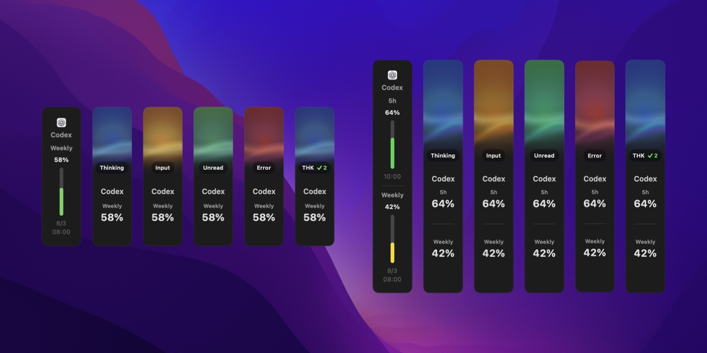
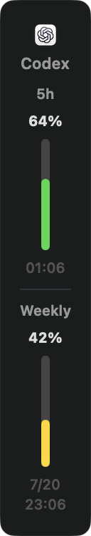
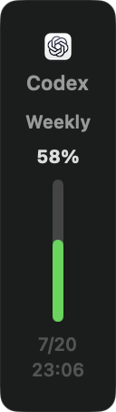
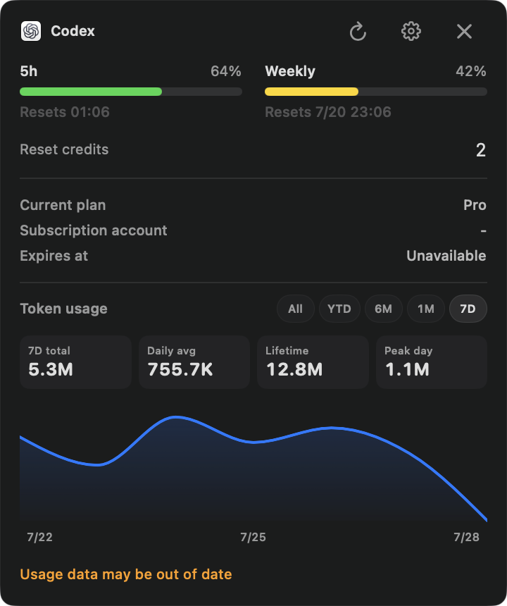
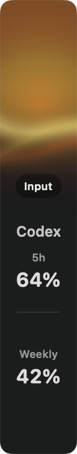
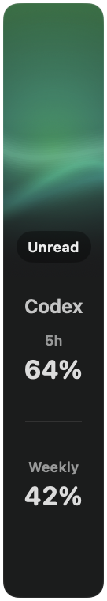
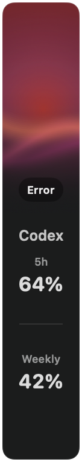

# Codex Usage HUD

<p align="center">
  
</p>

<p align="center">
  <strong>A native macOS usage monitor for Codex, Claude, and Kimi.</strong><br>
  Track AI coding limits, reset times, token history, and task activity in a floating HUD.
</p>

<p align="center">
  <a href="https://github.com/yaooop-tech/CodexUsageHUD/releases/latest"><strong>Download latest release</strong></a>
  · <a href="#screenshots">Screenshots</a>
  · <a href="#build-from-source">Build from source</a>
  · <a href="https://github.com/yaooop-tech/CodexUsageHUD/issues/new/choose">Report an issue</a>
</p>

<p align="center">
  <a href="https://github.com/yaooop-tech/CodexUsageHUD/releases/latest"></a>
  <a href="https://github.com/yaooop-tech/CodexUsageHUD/actions/workflows/ci.yml"></a>
  <a href="https://github.com/yaooop-tech/CodexUsageHUD/blob/main/LICENSE"></a>
  
  
</p>

<p align="center">
  
</p>

> If this helps you keep track of AI coding limits, a ⭐ helps other Mac developers discover it.

Codex Usage HUD is an independent open-source macOS utility by [yaooop-tech](https://github.com/yaooop-tech). It is not affiliated with, endorsed by, or supported by OpenAI, Anthropic, or Moonshot AI/Kimi.

> **Preview note:** The downloadable build currently supports macOS 14 or later on Apple Silicon. It is ad-hoc signed but not Developer ID signed or Apple notarized, so macOS may show a first-launch security warning. The release page explains the safe **Open** / **Open Anyway** path.

## Why this exists

AI coding tools expose usage windows in different places. This app keeps the information visible at the edge of your desktop so you can check a five-hour window, weekly limit, reset time, or active task without leaving your coding flow.

## Features

### Codex usage monitor

- Shows five-hour and weekly usage windows, reset information, and token history where available.
- Falls back to weekly-only mode when the short usage window is unavailable.
- Refreshes through a local Codex app-server connection with a local OAuth fallback.

### Claude and Kimi usage tracking

- Supports Claude Code / Claude Desktop through the user's enabled local status-line or OAuth connection.
- Supports Kimi Desktop / Kimi Code through the user's existing local session.
- Follows the frontmost supported app automatically, or stays locked to a selected provider.

### Task activity at a glance

- Aggregates running/thinking, completed-but-unread, needs-input, and error states.
- Retains a completion reminder while another task keeps running.
- Keeps the collapsed rail attached to the selected screen edge while expanding, collapsing, or resizing.
- Offers an expanded view with usage cards, reset information, token history where available, appearance controls, refresh interval, and launch-at-login.

## Supported providers

| Provider | What the HUD can show | Local connection |
| --- | --- | --- |
| Codex | Five-hour/weekly usage, reset data, token history, task activity | Codex app-server with local OAuth fallback |
| Claude Code / Claude Desktop | Five-hour/weekly usage, status-line session data, task activity | User-enabled status-line cache; optional OAuth monitoring |
| Kimi Desktop / Kimi Code | Desktop and coding windows, monthly information where available, task activity | Existing local Kimi Desktop or Kimi Code session |

The app recognizes the frontmost Codex, Claude Desktop, and Kimi Desktop apps in automatic mode. Each provider can also be selected manually in Settings.

## Screenshots

All screenshots use fixed demonstration data. They contain no real account, task, path, token, or personal usage information.

### Default, collapsed

| Five-hour + weekly | Weekly-only |
| :---: | :---: |
|  |  |

### Expanded

| Five-hour + weekly | Weekly-only |
| :---: | :---: |
|  |  |

### Activity states

| Multiple tasks running | Needs confirmation | One task completed | Running + multiple completed | Five-hour + weekly error |
| :---: | :---: | :---: | :---: | :---: |
|  |  |  |  |  |

## Install

1. Open the [latest release](https://github.com/yaooop-tech/CodexUsageHUD/releases/latest) and download the Apple Silicon ZIP.
2. Unzip it and move **Codex Usage HUD.app** to Applications if you want.
3. Right-click the app and choose **Open**. If Gatekeeper blocks it, open **System Settings → Privacy & Security** and choose **Open Anyway** after confirming the release source.
4. Start the provider apps you use, open the HUD, and leave source selection on **Automatic** or choose a fixed provider in Settings.

### First launch and preview limits

The preview build is not notarized. The first-launch warning is expected; use the macOS **Open** or **Open Anyway** flow after verifying that the ZIP came from this repository's release page. The downloadable ZIP contains only the app and its required helper. It contains no author account, local history, credentials, logs, screenshots, or machine configuration.

To remove the app, quit it and delete **Codex Usage HUD.app**. To also remove the local display cache and Claude status-line helper output, delete `~/Library/Application Support/Codex Usage HUD`.

## Privacy and safety

The HUD is local-first. It uses the signed-in user's existing local provider session only to request that user's usage information from the relevant provider. It does not operate an author-owned backend, analytics service, advertising SDK, automatic updater, or telemetry endpoint.

Provider support necessarily reads limited local state after the user chooses to use that provider. Read [PRIVACY.md](PRIVACY.md) for the exact boundary. Never post tokens, cookies, credentials, prompts, private logs, or personal screenshots in an issue.

## Build from source

```bash
swift test
./script/build_and_run.sh --no-run
```

The build produces `dist/Codex Usage HUD.app`. The build script is intended for local development and preview distribution. The preview app is not Developer ID signed or Apple notarized.

## Known limits

- The downloadable app is Apple Silicon only; Intel Mac users can build from source instead.
- Usage APIs and local data formats are controlled by each provider and may change.
- Provider availability depends on the corresponding app or CLI being installed and signed in on the user's Mac.
- This project displays usage and task state. It does not purchase credits, reset limits, modify subscriptions, or make account changes.

## Contributing and security

Bug reports, feature ideas, documentation improvements, and small code changes are welcome. Read [CONTRIBUTING.md](CONTRIBUTING.md) before opening a pull request, and read [SECURITY.md](SECURITY.md) before reporting a vulnerability or attaching diagnostic material.

During development, Codex was used to learn from CodexBar's public approach to discovering usage windows. Codex Usage HUD is independently implemented and is not a fork of or affiliated with CodexBar.

---

# Codex Usage HUD（中文）

Codex Usage HUD 是一个原生 macOS AI 编程用量监控工具。它把 Codex、Claude 和 Kimi 的额度窗口、重置时间、Token 历史和任务状态放在桌面边缘，让你不用离开当前编码流程。

这是 [yaooop-tech](https://github.com/yaooop-tech) 的独立开源项目，与 OpenAI、Anthropic、Moonshot AI/Kimi 均无隶属、合作、背书或官方支持关系。

> **体验版说明：** 当前可下载版本支持 macOS 14 或更高版本的 Apple Silicon Mac。App 使用临时签名但没有 Developer ID 签名和 Apple 公证，因此首次启动可能出现 macOS 安全提示。请按照 Release 页面说明使用“打开”或“仍要打开”。

如果这个工具对你的工作流有帮助，欢迎点一个 ⭐，帮助其他 Mac 开发者发现它。

## 它能做什么

- 显示 Codex 的五小时/周限额、重置信息，以及可用时的 Token 历史。
- 短窗口不可用时自动切换到仅周限额模式。
- 支持 Claude Code、Claude Desktop、Kimi Desktop 和 Kimi Code 的本地用量信息。
- 自动跟随当前前台的受支持应用，也可以在设置中固定为 Codex、Claude 或 Kimi。
- 聚合运行/思考中、完成未读、需要输入和错误等任务状态。
- 即使另一项任务仍在运行，完成提醒也不会被覆盖。
- 展开、收起或调整大小时，HUD 会保持吸附在选定的屏幕边缘。
- 设置中可选自动或固定来源、中文/英文、跟随系统/浅色/深色界面、刷新频率和登录时启动。

## 支持的来源

| 来源 | HUD 可显示的信息 | 连接方式 |
| --- | --- | --- |
| Codex | 五小时/周限额、重置数据、Token 历史、任务活动 | 本地 Codex app-server，并在需要时使用本地 OAuth 回退 |
| Claude Code / Claude Desktop | 五小时/周限额、状态栏会话信息、任务活动 | 用户主动启用状态栏缓存；OAuth 监控也需用户主动开启 |
| Kimi Desktop / Kimi Code | 桌面端和编程额度窗口、可用时的月度信息、任务活动 | 使用已有的 Kimi Desktop 或 Kimi Code 本地登录状态 |

自动模式会识别当前前台的 Codex、Claude Desktop 和 Kimi Desktop；你也可以在设置中手动固定来源。

## 截图

以下截图全部使用固定演示数据，不包含真实账号、任务、路径、凭据或个人用量。

### 默认收起态

| 五小时 + 周限额 | 仅周限额 |
| :---: | :---: |
|  |  |

### 展开态

| 五小时 + 周限额 | 仅周限额 |
| :---: | :---: |
|  |  |

### 活动状态

| 多任务运行中 | 待确认 | 单任务已完成 | 运行中 + 多任务已完成 | 五小时 + 周限额错误 |
| :---: | :---: | :---: | :---: | :---: |
|  |  |  |  |  |

## 安装

1. 打开 [最新 Release](https://github.com/yaooop-tech/CodexUsageHUD/releases/latest)，下载 Apple Silicon ZIP。
2. 解压后，把 **Codex Usage HUD.app** 移到“应用程序”文件夹（可选）。
3. 右键点按 App 并选择“打开”。如果 Gatekeeper 拦截，请在确认 Release 来源后，到“系统设置 → 隐私与安全性”选择“仍要打开”。
4. 启动你使用的工具后打开 HUD；在设置中保持“自动”，或选择固定来源。

### 首次启动与体验版限制

当前体验版没有 Apple 公证。首次启动时出现安全提示是预期行为；请确认 ZIP 来自本仓库的 Release 页面后，使用 macOS 的“打开”或“仍要打开”流程。ZIP 内只包含 App 和必需的辅助程序，不包含作者账号、本机历史、凭据、日志、截图或机器配置。

卸载时先退出 HUD，再删除 App。如果你也想清除本地显示缓存和 Claude 状态栏辅助输出，可删除 `~/Library/Application Support/Codex Usage HUD`。

## 隐私与安全

HUD 以本地运行为主。它仅使用用户自己已有的本地登录状态，向相应服务请求该用户自己的用量信息；没有作者自建后端、分析服务、广告 SDK、自动更新服务或遥测接口。

各来源的用量功能必然需要在用户选择使用该来源后读取有限的本地状态。准确边界请见 [PRIVACY.md](PRIVACY.md)。请勿在 Issue 中提交令牌、Cookie、凭据、提示词、私密日志或个人截图。

## 从源码构建

```bash
swift test
./script/build_and_run.sh --no-run
```

构建产物位于 `dist/Codex Usage HUD.app`。本项目的构建脚本用于本地开发和体验版分发；当前体验版 App 尚未进行 Developer ID 签名或 Apple 公证。

## 已知限制

- 下载版仅支持 Apple Silicon；Intel Mac 用户可自行从源码构建。
- 用量接口和本地数据格式由各服务商控制，未来可能变更。
- 各来源是否可用取决于用户的 Mac 上是否已安装并登录对应应用或 CLI。
- 本项目只负责显示与提醒，不购买 credits、不重置额度、不修改订阅或账户。

## 贡献与安全反馈

欢迎提交 Bug、功能建议、文档改进和小型代码改动。创建 Pull Request 前请先阅读 [CONTRIBUTING.md](CONTRIBUTING.md)；报告安全问题或附加诊断材料前，请先阅读 [SECURITY.md](SECURITY.md)。
