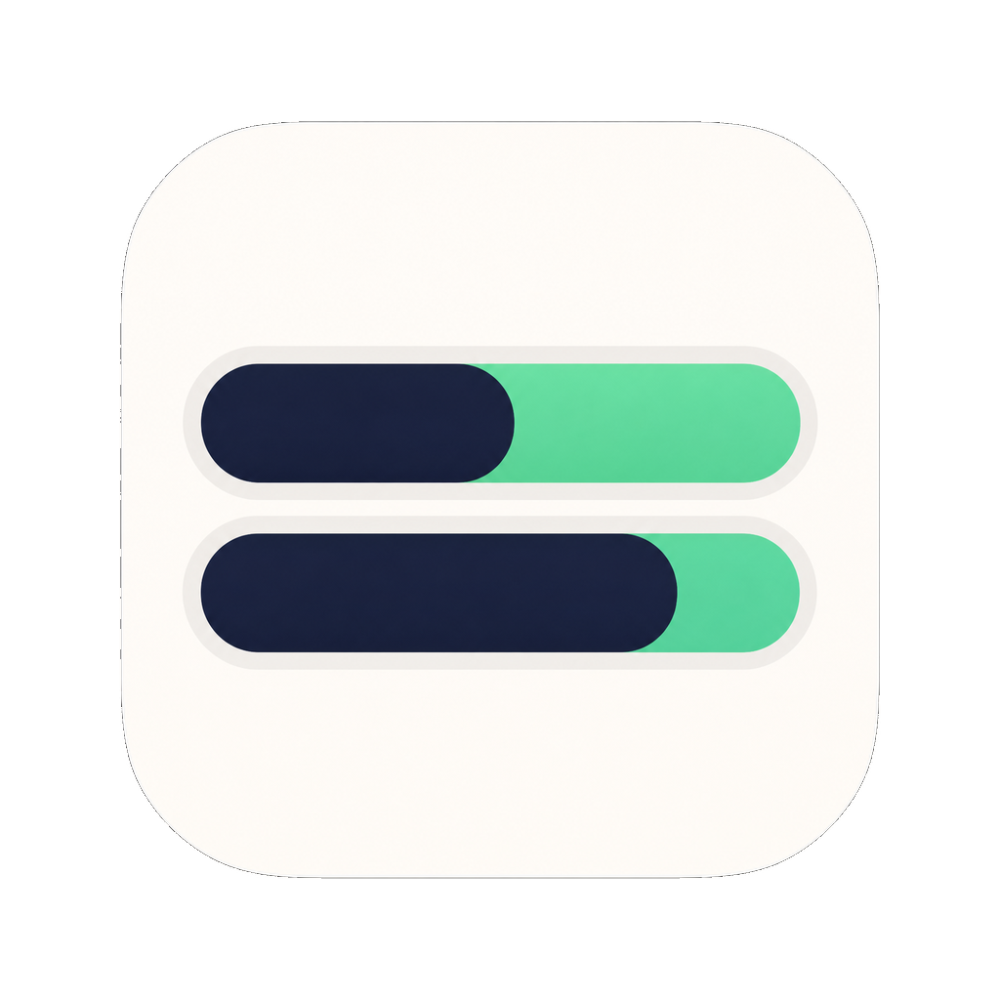
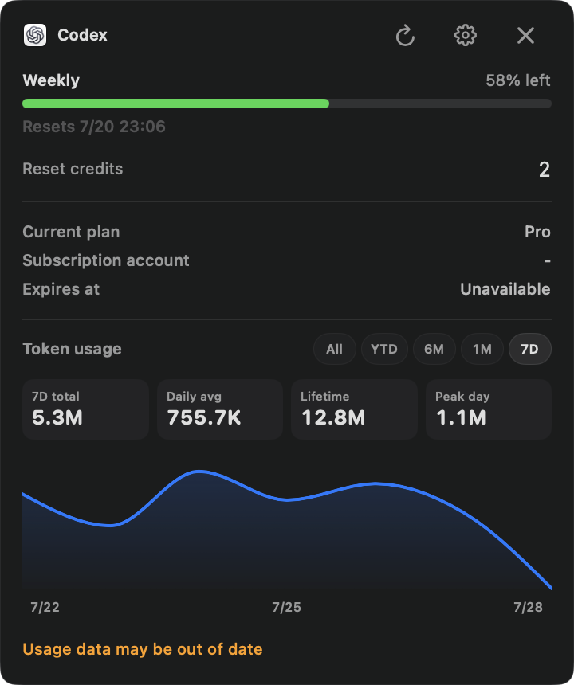

# Codex Usage HUD

<p align="center">
  
</p>

Codex Usage HUD is a small native macOS HUD for keeping AI coding usage windows and task activity visible without leaving your flow. It is built for people who want to glance at a 5-hour window, a weekly window, a reset time, or an active task instead of hunting through several apps.

This is an independent project by [yaooop-tech](https://github.com/yaooop-tech). It is not affiliated with, endorsed by, or supported by OpenAI, Anthropic, or Moonshot AI/Kimi.

## Public preview

The first downloadable build is a public preview for **macOS 14 or later on Apple Silicon**. It is deliberately unsigned and not notarized yet. macOS may show a security warning on first launch; after confirming that you downloaded it from this release, right-click the app, choose **Open**, then confirm in **System Settings → Privacy & Security** if macOS asks again.

The preview ZIP contains only the app and its required helper. It contains no author account, local history, credentials, logs, screenshots, or machine configuration.

## What it does

- Shows Codex, Claude, and Kimi usage in a compact floating HUD.
- Displays Codex in both **5-hour + weekly** mode and **weekly-only** mode when the short window is unavailable.
- Follows the frontmost supported app automatically, or stays locked to Codex, Claude, or Kimi when you prefer a fixed source.
- Aggregates activity from supported tools: running/thinking, completed-but-unread, needs-input, and error. A completion reminder is retained even while another task keeps running.
- Keeps the collapsed rail visually attached to the selected screen edge. Expanding, collapsing, or resizing preserves the attached edge instead of letting the HUD drift across the desktop.
- Offers a detailed expanded view with usage cards, reset information and token history where available. Settings cover automatic or fixed sources, English/Chinese, system/light/dark appearance, refresh interval, and launch-at-login.

## Supported sources

| Source | What the HUD can show | How it connects |
| --- | --- | --- |
| Codex | 5-hour/weekly usage, reset data, token history, task activity | Local Codex app-server with a local OAuth fallback |
| Claude Code / Claude Desktop | 5-hour/weekly usage, status-line session data, task activity | User-enabled status-line cache; optional OAuth monitoring |
| Kimi Desktop / Kimi Code | Desktop and coding windows, monthly information where available, task activity | Existing local Kimi Desktop or Kimi Code session |

The app recognizes the frontmost Codex, Claude Desktop, and Kimi Desktop apps for automatic switching. Each provider can also be selected manually in Settings.

## Screenshots

All images below use fixed demonstration data. They contain no real account, task, path, token, or personal usage information.

### Collapsed / idle

<p align="center"></p>

### Weekly-only fallback, expanded

<p align="center"></p>

### Activity states

| Multiple tasks running | Needs confirmation | One task completed |
| --- | --- | --- |
|  |  |  |

## Install

1. Download `CodexUsageHUD-v1.8.2-macos-arm64.zip` from the release page.
2. Unzip it and move **Codex Usage HUD.app** to Applications if you want.
3. Right-click the app and choose **Open**. If Gatekeeper blocks it, open **System Settings → Privacy & Security** and choose **Open Anyway**.
4. Start the apps you use, then open the HUD. In Settings, leave source selection on **Automatic** or choose a fixed provider.

To remove it, quit the HUD, delete the app, and remove `~/Library/Application Support/Codex Usage HUD` if you also want to remove its local display cache and Claude status-line helper output.

## Privacy and safety

The HUD is local-first. It uses the signed-in user's existing local provider session only to request that user's usage information from the relevant provider. It does not operate an operator-owned backend, analytics service, advertising SDK, or automatic updater.

Provider support necessarily reads limited local state after the user chooses to use that provider. Read [PRIVACY.md](PRIVACY.md) for the exact boundary. Never post tokens, cookies, credentials, prompts, private logs, or personal screenshots in an issue.

## Build from source

```bash
swift test
./script/build_and_run.sh --no-run
```

The build produces `dist/Codex Usage HUD.app`. The provided build script is for local development and preview distribution; the app is not Developer ID signed or Apple notarized in this release.

## Known preview limits

- The downloadable app is Apple Silicon only; Intel Mac users can build from source instead.
- Usage APIs and local data formats are controlled by each provider and may change.
- Provider availability depends on the corresponding app/CLI being installed and signed in on the user's Mac.
- This project is a display and reminder utility. It does not purchase credits, reset limits, modify provider subscriptions, or make account changes.

## Credits

During development, Codex was used to learn from CodexBar's public approach to discovering usage windows. Codex Usage HUD is independently implemented and is not a fork of or affiliated with CodexBar.

## Contributing and security

Bug reports and small improvements are welcome. Please read [SECURITY.md](SECURITY.md) before reporting a vulnerability or attaching diagnostic material.

---

# Codex Usage HUD（中文）

Codex Usage HUD 是一个原生 macOS 悬浮 HUD。它把 AI 编程工具的额度窗口、重置时间和任务状态放在桌面边缘，让你不用在多个应用之间反复寻找用量信息。

这是 [yaooop-tech](https://github.com/yaooop-tech) 的独立项目，与 OpenAI、Anthropic、Moonshot AI/Kimi 均无隶属、合作、背书或官方支持关系。

## 公开体验版说明

首个可下载版本是公开体验版，仅支持 **macOS 14 或更高版本的 Apple Silicon Mac**。它目前没有 Developer ID 签名和 Apple 公证，因此第一次启动时 macOS 可能会出现安全提示。请确认 App 来自本 Release 后，右键点按 App 选择“打开”；如仍被拦截，可前往“系统设置 → 隐私与安全性”选择“仍要打开”。

ZIP 内只包含 App 和必需的辅助程序，不包含作者账号、本机历史、凭据、日志、截图或机器配置。

## 它能做什么

- 在一个小型悬浮 HUD 中显示 Codex、Claude 和 Kimi 的用量。
- Codex 同时支持“5 小时 + 周限额”，也支持短窗口缺失时自动切换为“仅周限额”。
- 自动跟随当前前台的受支持应用；也可以在设置中固定为 Codex、Claude 或 Kimi。
- 聚合运行/思考中、完成未读、需要输入和错误等活动状态。即使另一项任务仍在运行，完成提醒也不会被覆盖。
- 收起态会吸附在你选定的屏幕边缘。展开、收起或调整大小时，HUD 会保持贴边，不会无故漂移。
- 展开后可查看用量卡片、重置时间和可用时的 Token 历史。设置中可选自动或固定来源、中文/英文、跟随系统/浅色/深色界面、刷新频率和登录时启动。

## 支持的来源

| 来源 | HUD 可显示的信息 | 连接方式 |
| --- | --- | --- |
| Codex | 5 小时/周限额、重置数据、Token 历史、任务活动 | 本地 Codex app-server，并在需要时使用本地 OAuth 回退 |
| Claude Code / Claude Desktop | 5 小时/周限额、状态栏会话信息、任务活动 | 用户主动启用状态栏缓存；OAuth 监控也需用户主动开启 |
| Kimi Desktop / Kimi Code | 桌面端和编程额度窗口、可用时的月度信息、任务活动 | 使用已有的 Kimi Desktop 或 Kimi Code 本地登录状态 |

自动模式会识别当前前台的 Codex、Claude Desktop 和 Kimi Desktop；你也可以在设置中手动固定来源。

## 截图

以下全部使用固定演示数据，不包含真实账号、任务、路径、凭据或个人用量。

### 收起 / 空闲

<p align="center"></p>

### 仅周限额展开态

<p align="center"></p>

### 活动状态

| 多任务运行中 | 待确认 | 单任务已完成 |
| --- | --- | --- |
|  |  |  |

## 安装

1. 在 Release 页面下载 `CodexUsageHUD-v1.8.2-macos-arm64.zip`。
2. 解压后，把 **Codex Usage HUD.app** 移到“应用程序”文件夹（可选）。
3. 右键点按 App 并选择“打开”。如果 Gatekeeper 拦截，请到“系统设置 → 隐私与安全性”选择“仍要打开”。
4. 启动你使用的工具后打开 HUD；在设置中保持“自动”，或选择固定来源。

卸载时，先退出 HUD，再删除 App。如果你也想清除本地显示缓存和 Claude 状态栏辅助输出，可删除 `~/Library/Application Support/Codex Usage HUD`。

## 隐私与安全

HUD 以本地运行为主。它仅使用用户自己已有的本地登录状态，向相应服务请求该用户自己的用量信息；没有运营者自建后端、分析服务、广告 SDK 或自动更新服务。

各来源的用量功能必然需要在用户选择使用该来源后读取有限的本地状态。准确边界请见 [PRIVACY.md](PRIVACY.md)。请勿在 Issue 中提交令牌、Cookie、凭据、提示词、私密日志或个人截图。

## 从源码构建

```bash
swift test
./script/build_and_run.sh --no-run
```

构建产物位于 `dist/Codex Usage HUD.app`。本 Release 的构建脚本用于本地开发和体验版分发；App 尚未进行 Developer ID 签名或 Apple 公证。

## 已知体验版限制

- 下载版仅支持 Apple Silicon；Intel Mac 用户可自行从源码构建。
- 用量接口和本地数据格式由各服务商控制，未来可能变更。
- 各来源是否可用取决于用户的 Mac 上是否已安装并登录对应应用或 CLI。
- 本项目只负责显示与提醒，不购买 credits、不重置额度、不修改订阅或账户。

## 贡献与安全反馈

欢迎提交 Bug 和小型改进。报告安全问题或附加诊断材料前，请先阅读 [SECURITY.md](SECURITY.md)。
